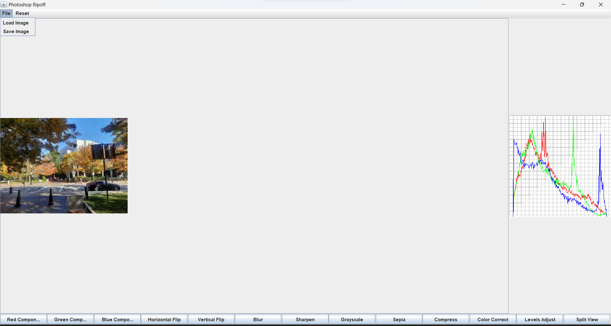
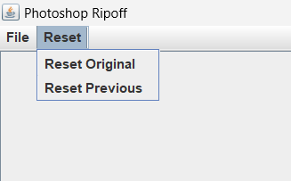
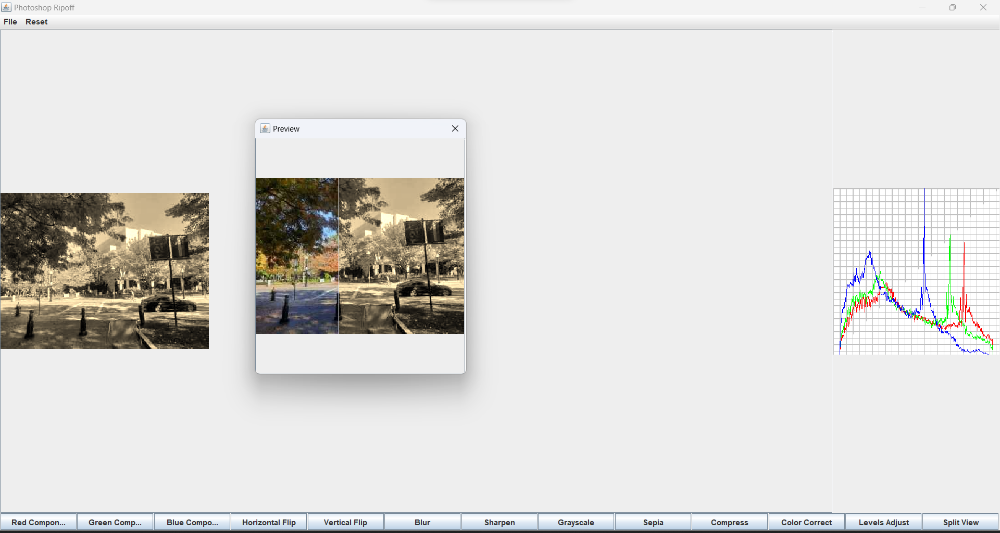

## Guide on Using the Program

### Text-Based Scripting

To use the text-based scripting interface, you can create and run scripts with the following
commands:

- `load image-path image-name`: Load an image from the specified path and refer to it by the given
  image name.
- `save image-path image-name`: Save the image with the given name to the specified path, which
  should include the file's format.
- `red-component image-name dest-image-name`: Create an image with only the red component of the
  given image.
- `green-component image-name dest-image-name`: Create an image with only the green component of the
  given image.
- `blue-component image-name dest-image-name`: Create an image with only the blue component of the
  given image.
- `value-component image-name dest-image-name`: Create an image to visualize the value component of
  the given image.
- `intensity-component image-name dest-image-name`: Create an image to visualize the intensity
  component of the given image.
- `luma-component image-name dest-image-name`: Create an image to visualize the luma component of
  the given image.
- `horizontal-flip image-name dest-image-name`: Flip an image horizontally.
- `vertical-flip image-name dest-image-name`: Flip an image vertically.
- `brighten increment image-name dest-image-name`: Brighten an image by adding the given increment.
- `darken decrement image-name dest-image-name`: Darken an image by subtracting the given decrement.
- `rgb-split image-name dest-image-name-red dest-image-name-green dest-image-name-blue`: Split the
  given image into its red, green, and blue components.
- `rgb-combine image-name red-image green-image blue-image`: Combine three grayscale images into a
  single color image.
- `blur image-name dest-image-name`: Apply a blur effect to the given image.
- `sharpen image-name dest-image-name`: Apply a sharpening effect to the given image.
- `sepia image-name dest-image-name`: Convert an image into a sepia-toned version.
- `levels-adjust b m w image-name dest-image-name`: Support the ability to adjust levels of an image.
- `color-correct image-name dest-image-name`: Support the ability to color-correct an image by aligning the meaningful peaks of its histogram.
- `histogram image-name dest-image-name`: Support the ability to produce an image that represents the histogram of a given image.
- `compress 20 image-name dest-image-name`: Supports the ability to compress an image given percentage p.
- `sepia image-name dest-image-name split 20`: Support split view to observe the changes(eg: 20% split)

### CONDITIONS FOR USING SCRIPT COMMANDS

- `load` command must always be used for loading any image before performing any operations on that image
- `histogram` command must be used after loading or performing any command on a particular image to
plot specific histogram as needed for color-corrected image, levels-adjusted image or the original image,etc.
- `save` command must be used for saving any particular image, this command must be used after a specific command
is used on the image to get the desired output.
- `rgb-combine` before running this command ensure you have red, green and blue components of images present.
- `split` is supported by blur, sharpen, sepia, grayscale, color-correct and level-adjust

### GRAPHICAL USER INTERFACE

We have built a graphical user interface for our application which is a user-friendly way to perform operations on the image.
- To load an image, select the "File" menu and then "Load File" option from the menu. Select the file using the file chooser. We support loading "jpg", "png" and "ppm" files.
- To save an image, select the "File" menu and then "Save File" option from the menu. Select the path using the file chooser.
- We support resetting and image to previous image as well as the original image using the Reset menu.
- We support the ability to flip an image horizontally and vertically using the Flip horizontal and Flip vertical buttons.
- We support the ability to get red, green, and blue components of an image using the Red Component, Green Component, and Blue Component buttons.
- We support getting sepia and gray scale images using the Sepia and Gray Scale buttons.
- We support blurring and sharpening an image using the Blur and Sharpen buttons.
- We can also compress the image using compress button. We can specify the compression ratio(1-100) using the pop-up window.
- We can also color correct the image using the Color Correct button.
- We can also adjust the levels of an image using the Levels Adjust button.
- The application constantly displays an histogram of the image which is displayed in the main panel.
- The split view toggle button can give you the preview of the previous image and the current image in split window style.

- 
- 

### EXAMPLES OF WRITING SCRIPT COMMANDS


```plaintext

# load fallneu file and call it 'fallneu'
load res/fallneu.jpg fallneu

# save fallneu
save res/fallneu.png fallneu

# seperate components
red-component fallneu fallneured
green-component fallneu fallneugreen
blue-component fallneu fallneublue

# flip fallneu horizontally
horizontal-flip fallneu fallneuhoriz

# flip fallneu vertically
vertical-flip fallneu fallneuvert

# flip fallneu horizontally and then vertically
horizontal-flip fallneu fallhor
vertical-flip fallhor fallhorver

# brighten fallneu by adding 10
brighten 10 fallneu fallneub

# darken fallneu by reducing 10
darken 10 fallneu fallneud

# split rgb components in fallneu
rgb-split fallneu fallneuredsp fallneugreensp fallneubluesp

# combine the rgb components of fallneu
rgb-combine fallneu-comb fallneured fallneugreen fallneublue

# blur the fallneu image
blur fallneu fallneublur

# sharpen fallneu image
sharpen fallneu fallneusharpen

# set the colortone of fallneu to sepia
sepia fallneu fallneusepia

# convert fall neu to grayscale
grayscale fallneu grayfallneu

# create a grayscale using only the value component, as an image fallneu-val
value-component fallneu fallneu-val

# create a grayscale using only the intensity component, as an image fallneu-int
intensity-component fallneu fallneu-int

# create a grayscale using only the luma component, as an image fallneu-luma
luma-component fallneu fallneu-luma

# color correction of image
color-correct fallneu fallcorr

# plot histogram of color corrected image
histogram fallcorr fallcorrhisto

# plot histogram of fallneu image
histogram fallneu fallhisto

# adjust levels of image
levels-adjust 20 100 255 fallneu fallneulevel

# plot histogram of level-adjusted image
histogram fallneulevel fallneulevelhisto

# compress image by 20 percent
compress 20 fallneu fallneu20comp

# compress image by 60 percent
compress 60 fallneu fallneu60comp

# split view for sharpen
sharpen fallneu fallneusharpensplit split 40

# split view for sepia
sepia fallneu fallneusepiasplit split 60
```